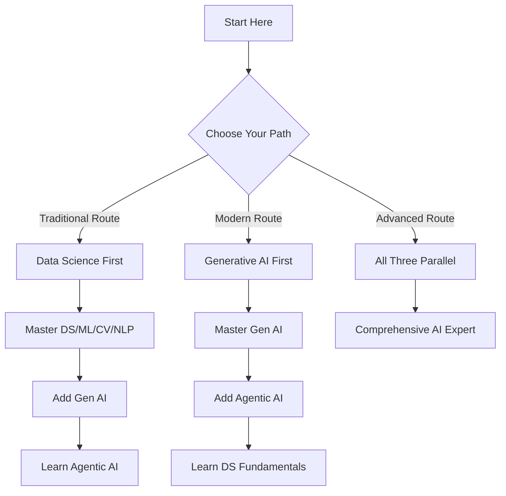

# 🚀 AI Mastery Roadmap 2025: Three Core Paths to Excellence

### **🎯 Master AI Through Three Comprehensive Learning Paths**

[**Section 1: Data Science & Classical AI**](#-section-1-data-science-nlp--computer-vision) | [**Section 2: Generative AI**](#-section-2-generative-ai) | [**Section 3: Agentic AI**](#-section-3-agentic-ai)

---

## 📌 Overview

Welcome to the most comprehensive AI learning roadmap for 2025! This guide presents three distinct but complementary paths to AI mastery. Whether you want to become a Data Scientist, Generative AI Engineer, or Agentic AI Developer, this roadmap will guide your journey.

### 🎓 Choose Your Path

| Path | Focus | Duration | Career Outcome |
|------|-------|----------|----------------|
| **🔵 Path 1** | Data Science, NLP, Computer Vision | 4 months | Data Scientist, ML Engineer |
| **🟣 Path 2** | Generative AI & LLMs | 2 months | GenAI Engineer, AI Product Developer |
| **🟠 Path 3** | Agentic AI & Autonomous Systems | 2 months | AI Architect, Agent Developer |

### 📊 Learning Approach

---

# 🔵 SECTION 1: DATA SCIENCE, NLP & COMPUTER VISION

> **The Foundation of AI: Master classical machine learning, deep learning, and specialized domains**
### 🔗 **[Perfect Roadmap To Learn Data Science In 2025](https://github.com/krishnaik06/Perfect-Roadmap-To-Learn-Data-Science-In-2025)**

This comprehensive roadmap covers:
- Python Programming & Mathematics
- Statistics & Machine Learning
- Deep Learning Fundamentals
- Computer Vision Applications
- Natural Language Processing
- MLOps & Deployment

# 🟣 SECTION 2: GENERATIVE AI

> **The Creative Revolution: Master Large Language Models, Diffusion Models, and Creative AI**

## 🎨 Complete Generative AI Roadmap

Explore the cutting-edge world of Generative AI with comprehensive learning resources:

### 🔗 **[Roadmap To Learn Generative AI In 2025](https://github.com/krishnaik06/Roadmap-To-Learn-Generative-AI-In-2025)**

This roadmap includes:
- Large Language Models (LLMs)
- Prompt Engineering
- Diffusion Models & Image Generation
- Fine-tuning Techniques
- Multi-modal AI Systems
- Production Deployment

---

# 🟠 SECTION 3: AGENTIC AI

> **The Autonomous Future: Build intelligent agents that can reason, plan, and act independently**

## 🤖 Complete Agentic AI Roadmap

Master the development of autonomous AI agents and systems:

### 🔗 **[Roadmap To Learn Agentic AI](https://github.com/krishnaik06/Roadmap-To-Learn-Agentic-AI)**

This roadmap covers:
- AI Agent Fundamentals
- LangChain & LangGraph
- Multi-Agent Systems
- RAG (Retrieval-Augmented Generation)
- Tool Use & Function Calling

---

## 📚 Additional Learning Resources

### 🎓 Udemy Courses Roadmap

For structured video-based learning with hands-on projects:

### 🔗 **[Complete Data Science And GenAI Course Roadmap - Udemy](https://github.com/krishnaik06/Complete-Data-Science-And-GenAI-Course-In-Udemy)**

Access comprehensive Udemy courses covering:
- Complete Python Programming
- Data Science Bootcamp
- Machine Learning & Deep Learning
- Generative AI with LangChain
- Agentic AI Development
- Computer Vision & NLP

### 🔴 Live Courses & Mentorship

For interactive learning with live instruction and direct mentorship:

### 🔗 **[Live Classes with Krish Naik](http://krishnaik.in/liveclasses)**

Join live courses featuring:
- Real-time Q&A sessions
- Hands-on project guidance
- Industry expert interactions
- Career counseling
- Certificate programs
- Community support

---
### Free Counselling Team And Career Guidance.
We also provide free counselling and career guidance.📞Connect with our counselling team: +919111533440 or +9184848 37781

## 🎯 How to Use These Roadmaps

1. **Choose Your Path**: Start with the section that aligns with your goals
2. **Follow the Repository**: Each linked repository contains detailed week-by-week plans
3. **Complete Projects**: Hands-on projects are included in each roadmap
4. **Track Progress**: Use the provided checklists to monitor your learning journey

## 💡 Learning Recommendations

- **Beginners**: Start with Section 1 (Data Science) for strong foundations
- **Developers**: Can jump to Section 2 (Generative AI) if comfortable with programming
- **Advanced Learners**: Explore Section 3 (Agentic AI) for cutting-edge AI systems

---
