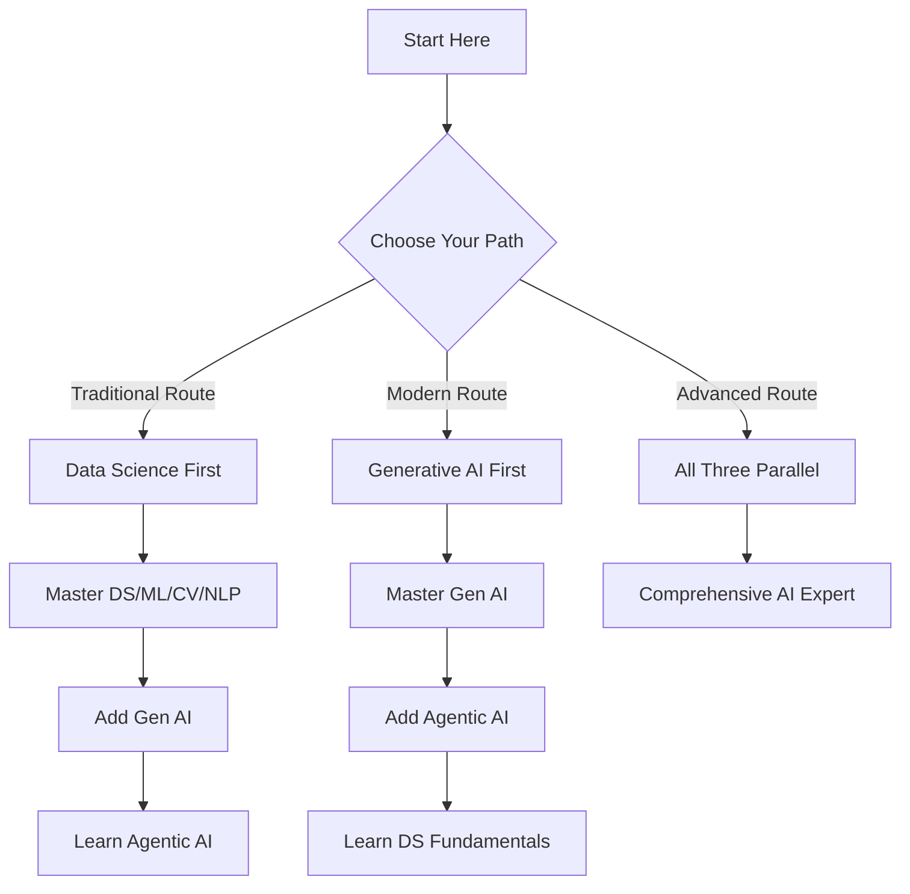

# 🚀 AI Mastery Roadmap 2025: Three Core Paths to Excellence

### **🎯 Master AI Through Three Comprehensive Learning Paths**

[**Section 1: Data Science & Classical AI**](#-section-1-data-science-nlp--computer-vision) | [**Section 2: Generative AI**](#-section-2-generative-ai) | [**Section 3: Agentic AI**](#-section-3-agentic-ai)

---

## 📌 Overview

Welcome to the most comprehensive AI learning roadmap for 2025! This guide presents three distinct but complementary paths to AI mastery. Whether you want to become a Data Scientist, Generative AI Engineer, or Agentic AI Developer, this roadmap will guide your journey.

### 🎓 Choose Your Path

| Path | Focus | Duration | Career Outcome |
|------|-------|----------|----------------|
| **🔵 Path 1** | Data Science, NLP, Computer Vision | 4 months | Data Scientist, ML Engineer |
| **🟣 Path 2** | Generative AI & LLMs | 2 months | GenAI Engineer, AI Product Developer |
| **🟠 Path 3** | Agentic AI & Autonomous Systems | 2 months | AI Architect, Agent Developer |

### 📊 Learning Approach

---

# 🔵 SECTION 1: DATA SCIENCE, NLP & COMPUTER VISION

> **The Foundation of AI: Master classical machine learning, deep learning, and specialized domains**
### 🔗 **[Perfect Roadmap To Learn Data Science In 2025](https://github.com/krishnaik06/Perfect-Roadmap-To-Learn-Data-Science-In-2025)**

This comprehensive roadmap covers:
- Python Programming & Mathematics
- Statistics & Machine Learning
- Deep Learning Fundamentals
- Computer Vision Applications
- Natural Language Processing
- MLOps & Deployment
